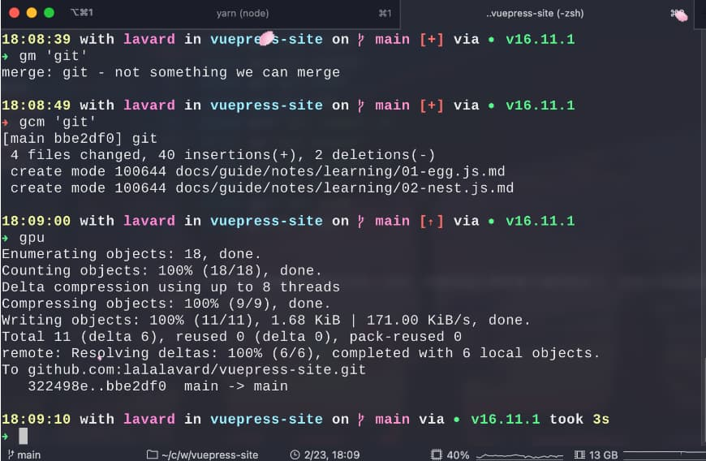
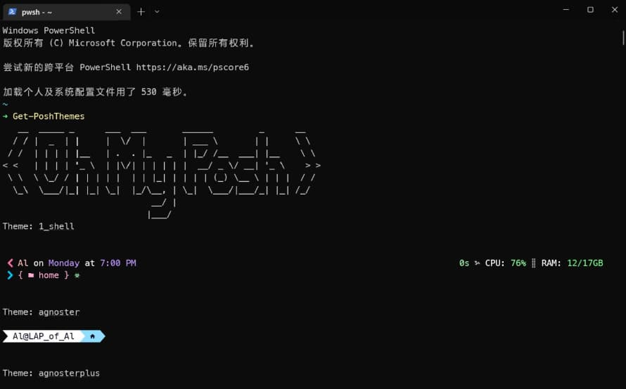

# 终端美化(Mac/Win)

> 程序员每天都需要跟 终端(terminal) 打交道, 因此打造一个 好用颜值又高的 终端 是非常有必要的 , 本文将介绍笔者的终端配置 和 美化教程 , 你永远可以相信 `lavard`的审美

## Mac

### Item2 (效果图)

> 笔者使用的 终端软件 为 `Item2`, 一个终端即可显示 `CPU / MEMORY usage`, `Git branch`, `Node.js version` , 当前时间 和系统信息 一目了然



### oh-my-zsh(shell)

```bash {2,5,8,11,14,17}
# 1.查看当前系统 shell
echo $SHELL

# 2.查看系统安装的 shell
cat /etc/shells

# 3. 安装zsh(安装失败请使用魔法 / 或者自行克隆仓库做镜像)
sh -c "$(curl -fsSL https://raw.github.com/robbyrussell/oh-my-zsh/master/tools/install.sh)"

# 4. 查看zsh版本，出来即成功
zsh --version

# 5. 切换系统 shell 为 zsh
chsh -s/bin/zsh

# 6. 重载shell配置以生效
source ~/.zshrc
```

### powerline(字体)

> 这个需要给系统安装字体的，过程很快，详情安装方法 参考 [powerline](https://github.com/powerline/powerline) 仓库地址

### spaceship(主题)

```bash {2,5,8-9,12}
# 1. 克隆主题仓库
git clone https://github.com/spaceship-prompt/spaceship-prompt.git "$ZSH_CUSTOM/themes/spaceship-prompt" --depth=1

# 2.软连接目录到本地克隆仓库
ln -s "$ZSH_CUSTOM/themes/spaceship-prompt/spaceship.zsh-theme" "$ZSH_CUSTOM/themes/spaceship.zsh-theme"

# 3. 配置zshrc文件
vim ~/.zshrc # 编辑zshrc文件
ZSH_THEME="spaceship"  #配置zsh主题为spaceship

# 4. 重载zsh配置以生效
source ~/.zshrc

# 5. (可选) 配置别名 , zsh 可玩性非常高 , 感兴趣自行研究
alias gc='git clone'
alias gs='git status'
alias gd='git diff'
alias ga='git add .'
alias gcm='git commit -m'
alias gb='git branch'
alias gba='git branch -a'
alias gp='git pull'
alias gpu='git push'
alias gl='git log'
```

## Windows

[参考自知乎大佬 Blank](https://zhuanlan.zhihu.com/p/354603010)

> Windows 有 非常多的 `terminal` 选择 , 如 Xshell、MobaXterm、Cmder... , 不过我大多数还是会选择`Windows Terminal`, 微软出品, 必属精品.

在 windows 下想要得到不错的 终端体验还是要`WSL` , 但如果你不想折腾`WSL` , 那么可以 尝试我的方案~

### Windows Terminal (效果图)



### MesloLGM NF(字体)

> 可自行更换自己喜欢的字体, 下载完解压安装到系统即可

笔者推荐的主题为 `MesloLGM NF` , [下载地址](https://github.com/ryanoasis/nerd-fonts/releases/download/v2.1.0/Meslo.zip)

### oh-my-posh(shell)

> 详细安装过程参考 [oh-my-posh](https://ohmyposh.dev/)

```bash {13,21,24,33,30,36}
# 1. Microsoft Store(微软商店) 下载 oh-my-posh , Windows Terminal也在这安装

# 2. 打开 Windows Terminal的 setting.json 配置文件 (快捷键 Ctrl + Shift + ,(逗号))

# 3. 修改profile配置项 值为 安装的字体

"profiles":
{
    "defaults":
    {
        "font":
        {
            "face": "DejaVuSansMono Nerd Font",
            "size": 14
        }
    },
    # ....
}

# 4. 使用编辑器编辑配置文件
notepad $profile

# 第一次会显示找不到该文件，选择创建新文件，然后输入并保存
oh-my-posh init pwsh | Invoke-Expression

# 5. 重新打开Windows Terminal 新建一个 CMD / Powershell
此时终端已经应用字体, 但主题样式还是默认的

# 6. 默认主题，若想修改主题，可以使用以下命令找到主题文件的目录
Get-PoshThemes

# 7. 拷贝主题文件路径 并加入到配置文件中
notepad $profile

# 使用记事本编辑配置文件,也可以使用 code(VSC) 打开配置文件
oh-my-posh init pwsh --config 主题文件路径 | Invoke-Expression
```
