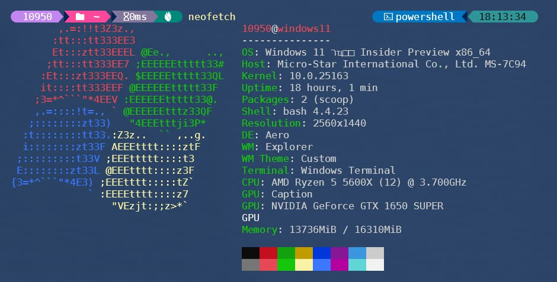
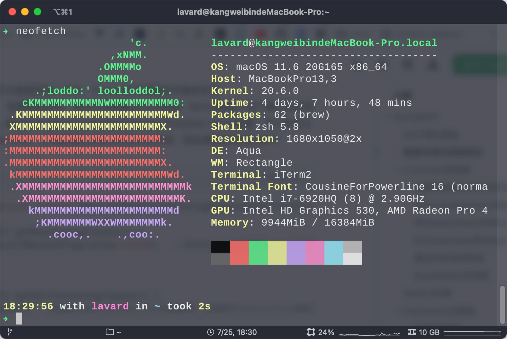
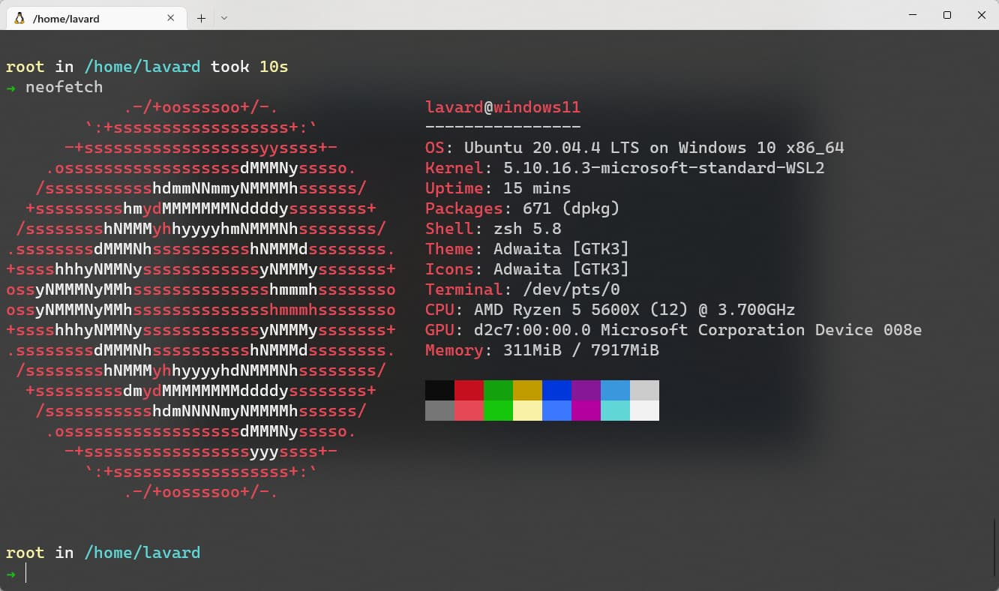

# neofetch

> Neofetch 是一个简单但有用的命令行系统信息工具，它用 Bash 编写。它会收集有关系统软硬件的信息，并在终端中显示结果。

本文将通过 `neofetch` 获取 各操作系统的信息 , 让你可以更加方便的查看系统信息。

## Windows

```bash
# 1. 安装scoop (windows的第三方包管理器,类似Mac的homebrew)

iwr -useb get.scoop.sh | iex

# 2. 安装neofetch

scoop install neofetch

# 3. 获取系统信息

neofetch
```



## Mac

1.  Run `brew install neofetch` after installing [Homebrew](http://brew.sh/)
2.  Run `neofetch`



## Linux

💡 点击访问 `screenFetch` 源码仓库 , 自行对应使用的 Linux 发行版 安装 [screenFetch](https://github.com/KittyKatt/screenFetch)

```bash
# 以 ubuntu/debian 为例, 安装screenfetch

sudo apt-get install screenfetch

# 运行screenfetch

screenfetch
```


