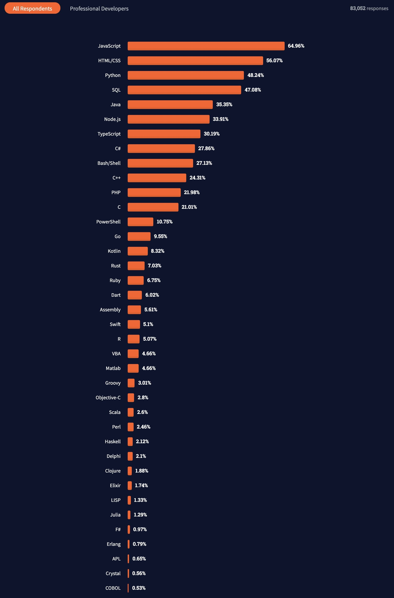
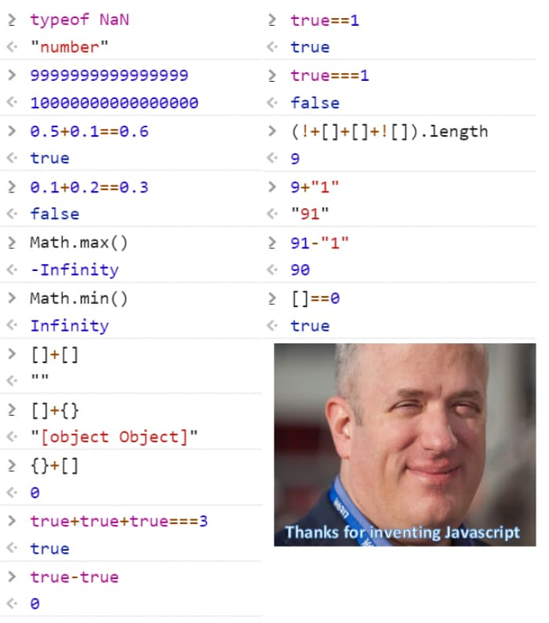

# JavaScript-介绍

:::tip JavaScript是一门单线程弱类型脚本语言

不像后端语言五花八门(`Java GO PHP C# Ruby...`)，前端唯一可选择的编程语言只有`JavaScript` (or Rust)

:::

## JavaScript生态丰富

:::info 阿特伍德定律(Atwood’s Law)

Stack Overflow 联合创始人 Jeff Wood 在2007年曾说过，任何一个能用 JavaScript 编写的应用系统，最终都必将使用 JavaScript 实现。

:::

## JavaScript前景

**根据2021年Stack Overflow年度报告，JavaScript连续九年成为最常用的编程语言。在Github上, 使用JavaScript的仓库数量也是遥遥领先其他语言**

## "严谨"的JavaScript

:::danger 小心JS的类型转换!

弱类型就是类型是不固定的，会随着运行而进行隐式类型转换，在JS中字符串可以用单引号''也可以用双引号""，它们没有区别。在项目迭代维护过程中，JS这个特性常常让人捉摸不透，因此学习给JS加了类型规范的TypeScript是很有必要的。但我相信，即便如此，你依然会爱上JavaScript的。
:::

## ECMA Script

ECMAScript和JavaScript的关系是，前者是后者的规格，后者是前者的一种实现

比较著名的ES2015, 也就是ES6 , 增加许多现代特性, 现在的ES版本是ES2022,也就是ES NEXT